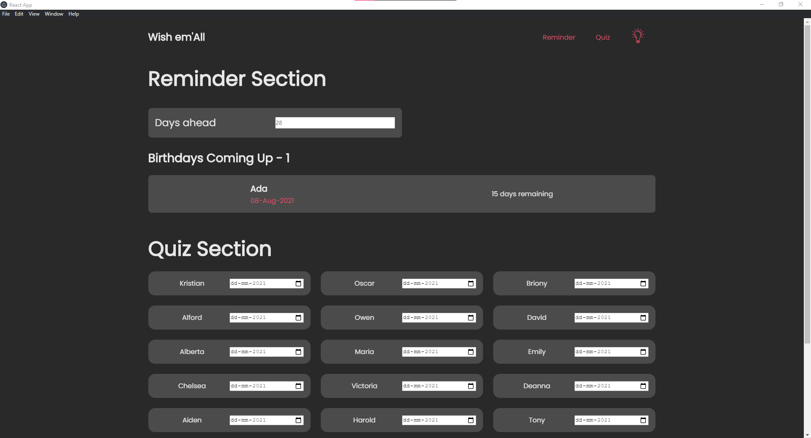
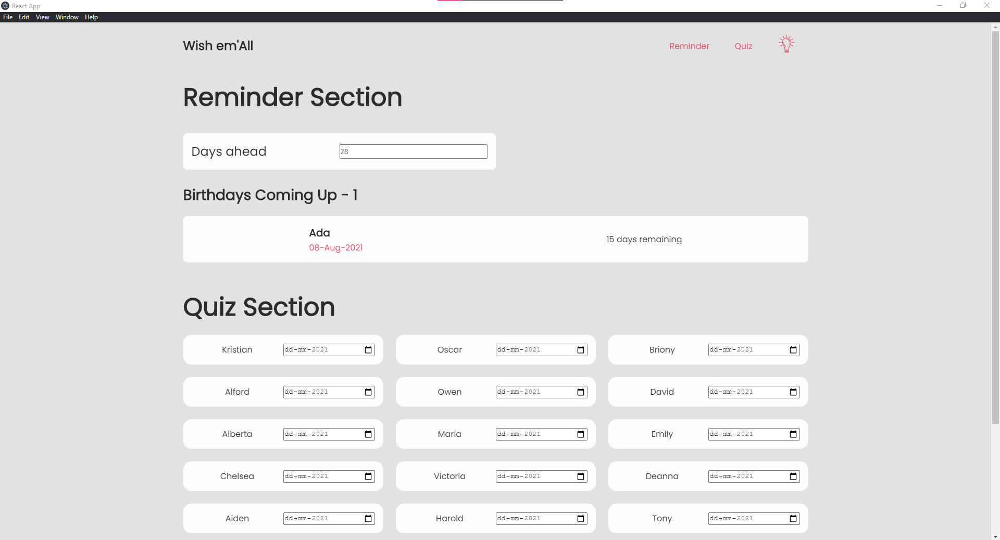
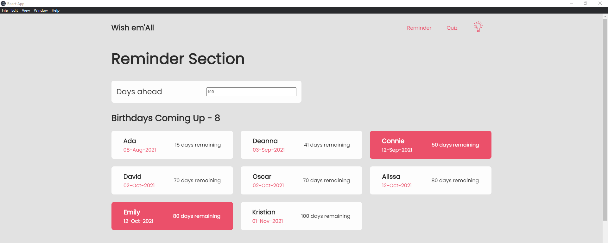
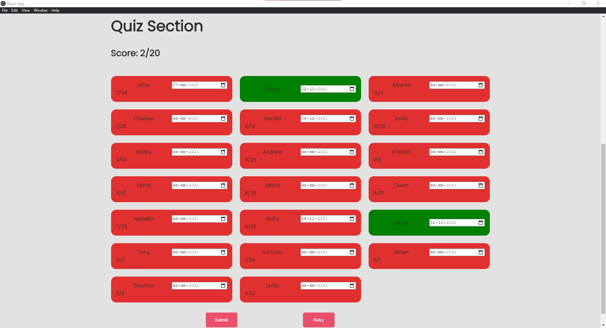

# birthday-application-github-page

### Description
*This is a GitHub page that hosts the Electron application made in the birthday-application repository.* 

### Website 

### Technology 
* JavaScript
  - ReactJS

* Python (preprocessing)

### Website in Action
* Dark-mode 

* Light-mode

* Upcoming Birthdays section 

* Quiz Section 

### Repository Link
* [Electron application](https://github.com/KrishnaBellamkonda/birthday-application) 
* [Data Preprocessing](https://github.com/KrishnaBellamkonda/birthday-application-data-processing)

